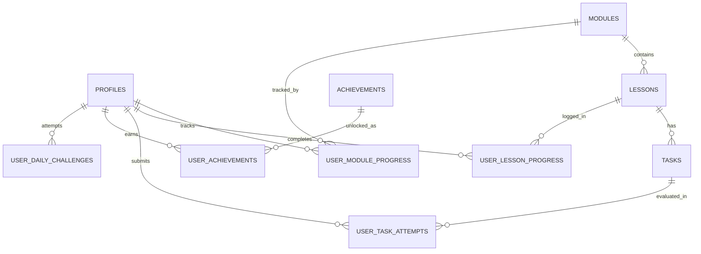
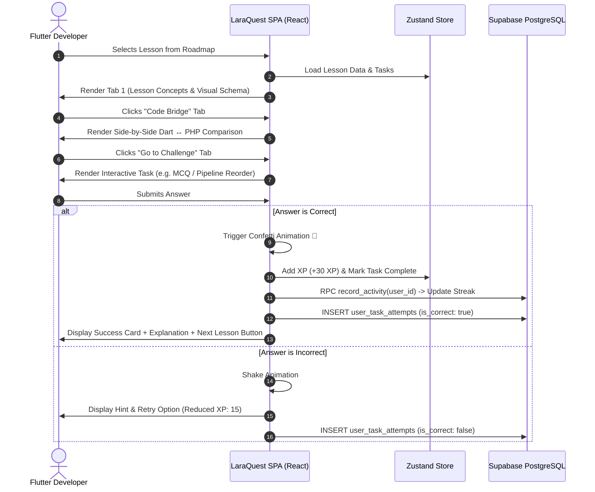
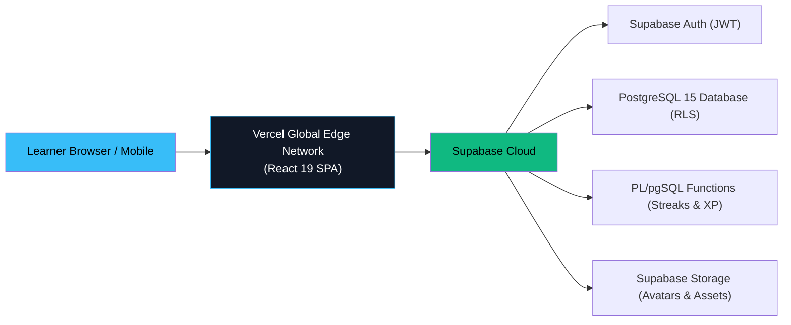

# 🚀 LaraQuest — Master Architecture & Implementation Plan

> *"From Flutter to Full-Stack"* — A gamified, interactive learning platform engineered specifically for mobile/frontend developers mastering Laravel REST APIs and relational database architecture.

---

## 📑 Table of Contents

1. [Core Philosophy & Learner Mental Model](#1-core-philosophy--learner-mental-model)
2. [Hybrid UX Architecture (Cherry-Picked from Reference Apps)](#2-hybrid-ux-architecture-cherry-picked-from-reference-apps)
3. [Technology Stack & Project Structure](#3-technology-stack--project-structure)
4. [Design System & Theme Tokens](#4-design-system--theme-tokens)
5. [Gamification & Anti-Abandonment Engine](#5-gamification--anti-abandonment-engine)
6. [Master Curriculum: 5 Tracks, 20 REST API Modules](#6-master-curriculum-5-tracks-20-rest-api-modules)
7. [Interactive Task Types & Visual Teaching Tools](#7-interactive-task-types--visual-teaching-tools)
8. [Supabase Database Architecture & Complete SQL Schema](#8-supabase-database-architecture--complete-sql-schema)
9. [End-to-End Lesson Flow & Lifecycle Sequence](#9-end-to-end-lesson-flow--lifecycle-sequence)
10. [Development Roadmap & Phased Delivery Milestones](#10-development-roadmap--phased-delivery-milestones)
11. [Deployment Architecture](#11-deployment-architecture)

---

## 1. Core Philosophy & Learner Mental Model

### The Dilemma
Mobile developers (particularly Flutter/Dart engineers) interact with backends every single day: they invoke `dio.get('/api/posts')`, parse JSON response bodies into model classes with `factory Model.fromJson()`, store auth JWTs in `flutter_secure_storage`, and handle 422 HTTP validation errors in try-catch blocks. However, the server side remains a mysterious black box. 

Common roadblocks include:
- **Database design paralysis:** Not knowing relational modeling, foreign keys, normalization, or indexing.
- **Short attention span & inconsistent learning:** Traditional 40-hour video courses lead to boredom and dropouts within days.
- **Mental syntax mismatch:** Translating Dart's strongly typed, single-threaded, client-side state model to PHP 8's request-lifecycle, multi-process web server model.

### The Solution: The LaraQuest Pedagogical Formula

| Learner Challenge | LaraQuest Solution |
|---|---|
| **Loses focus / gets bored quickly** | **5-minute bite-sized micro-lessons** with zero filler. Read for 3 minutes, experiment for 2 minutes. |
| **Loses interest / inconsistency** | **Gamification engine:** XP, streak counter with freeze protection, 10 progression ranks, achievement badges. |
| **Unfamiliar with database design** | **Visual Schema Playground:** Drag-and-drop relational tables, draw foreign key relationships visually before writing SQL. |
| **Learns best via analogies & comparisons** | **"Flutter ↔ Laravel Bridge":** Every single lesson features side-by-side Dart vs. PHP code panels. |
| **Needs immediate dopamine feedback** | **In-browser interactive challenges:** Instant validation for MCQs, code-translators, pipeline reordering, and fill-in-the-blank code. |

---

## 2. Hybrid UX Architecture (Cherry-Picked from Reference Apps)

LaraQuest unites the best ergonomics from both reference designs:

```mermaid
graph TD
    subgraph FromRef1["From Reference 1 (laraflutter-frontend)"]
        R1_Tabs["3-Tab Lesson Architecture\n(Lesson | Code Bridge | Challenge)"]
        R1_Cards["Numbered Key Concept Cards"]
        R1_Actions["Explicit Action Triggers\n('View Bridge' / 'Go to Challenge' / 'Mark Complete')"]
        R1_Modal["Celebratory Lesson Completion Modal"]
    end

    subgraph FromRef2["From Reference 2 (laraflutter-frontend 2)"]
        R2_Playground["Interactive Schema Playground\n(Draggable tables + FK cables)"]
        R2_Panels["Synchronized Side-by-Side Code Bridge"]
        R2_Lifecycle["Animated HTTP Lifecycle Visualizer"]
        R2_Hero["Dashboard Hero + Live Request-Trace Card"]
        R2_FX["Midnight Dark Theme & Ambient Glows"]
    end

    subgraph UnifiedApp["LaraQuest Production Platform"]
        R1_Tabs --> UnifiedApp
        R1_Cards --> UnifiedApp
        R1_Actions --> UnifiedApp
        R1_Modal --> UnifiedApp
        R2_Playground --> UnifiedApp
        R2_Panels --> UnifiedApp
        R2_Lifecycle --> UnifiedApp
        R2_Hero --> UnifiedApp
        R2_FX --> UnifiedApp
    end

    style UnifiedApp fill:#0b0f19,stroke:#38bdf8,stroke-width:2px,color:#f8fafc
```

### The Cherry-Pick Matrix

1. **Tabbed Lesson Engine (Reference 1):** Eliminates infinite scroll fatigue. Users switch effortlessly between **Lesson** (mental model + schema diagram), **Code Bridge** (side-by-side Dart↔PHP comparison), and **Challenge** (interactive task).
2. **Explicit Next Actions (Reference 1):** Clear call-to-action buttons (`View Code Bridge →`, `Take Challenge →`, `Mark Complete ✅`) provide unambiguous forward momentum.
3. **Interactive Schema Playground (Reference 2):** A full canvas sandbox where learners drag relational table nodes (`users`, `posts`, `comments`, `tags`), link Primary Keys (`PK`) to Foreign Keys (`FK`), and see migrations generate in real-time.
4. **Live Request-Trace Card (Reference 2):** Visualizes the real-time journey of a packet: `Flutter Dio` → `Nginx` → `Route` → `Middleware` → `Controller` → `Eloquent` → `JSON Envelope`.
5. **Side-by-Side Desktop / Tabbed Mobile Code Bridge (Reference 2):** Displays Dart code on the left and PHP/Laravel on the right with synchronized line highlighting.

---

## 3. Technology Stack & Project Structure

### Tech Stack

| Layer | Technology | Selection Rationale |
|---|---|---|
| **Runtime & Bundler** | Vite 6 + React 19 | Ultra-fast HMR, lightweight SPA bundle |
| **Language** | TypeScript (Strict) | 100% type safety for lesson models, tasks, and state |
| **Styling** | TailwindCSS v4 + Custom Theme | Modern CSS-first engine with zero configuration bloat |
| **State Management** | Zustand 5 | Scalable, boilerplate-free state for auth, progress, and themes |
| **Icons** | Lucide React | Clean, modern vector icon set |
| **Routing** | React Router v7 | Modern declarative client-side routing |
| **Backend & Database** | Supabase (PostgreSQL 15) | Relational SQL, Row-Level Security (RLS), Auth, Realtime & RPC |
| **Celebrations** | canvas-confetti | Lightweight celebratory confetti bursts on completed tasks |

### Project Directory Structure

```
laravel_tutorial/
├── PLAN.md                          # Single Authoritative Master Architecture & Plan
├── index.html                       # HTML5 App Shell with Google Fonts (Outfit, Inter, JetBrains Mono)
├── package.json                     # Dependencies & scripts
├── vite.config.ts                   # Vite configuration
├── tsconfig.json                    # Strict TypeScript configuration
├── public/                          # Static assets
└── src/
    ├── main.tsx                     # React application entry point
    ├── App.tsx                      # Router configuration & shell layout
    ├── index.css                    # Tailwind v4 import & midnight slate theme tokens
    │
    ├── types/                       # Shared TypeScript definitions
    │   ├── lesson.ts                # Lesson, Module, Track, ContentBlock types
    │   ├── task.ts                  # MCQ, CodeFill, Ordering, SpotBug, Matching types
    │   ├── user.ts                  # Profile, Achievement, Streak types
    │   └── schema.ts                # Database table, column, relationship types
    │
    ├── lib/                         # Core utilities & API clients
    │   ├── supabase.ts              # Supabase client with offline demo fallback
    │   └── constants.ts             # XP thresholds, rank definitions, badge metadata
    │
    ├── store/                       # Zustand state stores
    │   ├── useAuthStore.ts          # Auth state, login/logout, profile syncing
    │   └── useProgressStore.ts      # Completed lessons, streak, XP, active tasks
    │
    ├── components/
    │   ├── layout/                  # Navigation & layout wrappers
    │   │   ├── Navbar.tsx           # Mobile top bar with logo & quick stats
    │   │   ├── Sidebar.tsx          # Desktop fixed sidebar with navigation
    │   │   ├── MobileNav.tsx        # Mobile bottom floating tab bar
    │   │   └── Layout.tsx           # Responsive layout container
    │   │
    │   ├── dashboard/               # Dashboard widgets & telemetry
    │   │   ├── HeroBanner.tsx       # Welcome banner + continue CTA
    │   │   ├── RequestTraceCard.tsx # Animated HTTP packet trace widget
    │   │   ├── XPBar.tsx            # Animated XP progress bar + rank badge
    │   │   ├── StreakFlame.tsx      # Animated streak flame counter
    │   │   ├── QuickStats.tsx       # 4-card statistics grid
    │   │   └── ModuleCard.tsx       # Roadmap module card with progress ring
    │   │
    │   ├── lesson/                  # Lesson experience components
    │   │   ├── LessonHeader.tsx     # Sticky breadcrumb bar with reading time & XP
    │   │   ├── LessonTabs.tsx       # 3-tab switcher (Lesson | Code Bridge | Challenge)
    │   │   ├── LearnTab.tsx         # Structured lesson renderer (cards, callouts, schema)
    │   │   ├── CodeBridgeTab.tsx    # Side-by-side Dart ↔ PHP code comparison
    │   │   ├── SchemaDiagram.tsx    # Visual entity-relationship diagram
    │   │   ├── ConceptCard.tsx      # Numbered key takeaway card
    │   │   └── CompleteModal.tsx    # Confetti modal with XP award & next lesson CTA
    │   │
    │   ├── challenge/               # Interactive challenge runners
    │   │   ├── ChallengeRunner.tsx  # Task dispatcher and submit handler
    │   │   ├── MCQRunner.tsx        # Multiple-choice question runner
    │   │   ├── OrderingRunner.tsx   # Request pipeline sequence drag/reorder
    │   │   ├── CodeFillRunner.tsx   # Fill-in-the-blank code runner
    │   │   └── FeedbackCard.tsx     # Animated success/error explanation card
    │   │
    │   ├── playground/              # Visual DB Designer
    │   │   ├── SchemaPlayground.tsx # Interactive canvas for table nodes
    │   │   ├── TableCard.tsx        # Draggable table entity card (PK/FK/columns)
    │   │   ├── RelationshipLine.tsx # SVG connector cables between tables
    │   │   └── PresetSelector.tsx   # Templates (1:N Blog, N:M Tags, E-Commerce)
    │   │
    │   └── ui/                      # Base atomic components
    │       ├── Button.tsx
    │       ├── Card.tsx
    │       ├── Badge.tsx
    │       ├── ProgressRing.tsx
    │       └── Toast.tsx
    │
    └── pages/                       # Top-level route views
        ├── DashboardPage.tsx        # Main dashboard + vertical roadmap
        ├── RoadmapPage.tsx          # Full curriculum track explorer
        ├── LessonPage.tsx           # The unified 3-tab lesson viewer
        ├── PlaygroundPage.tsx       # Fullscreen Schema Playground
        ├── ProfilePage.tsx          # Learner profile, achievements & stats
        └── LoginPage.tsx            # Supabase auth + instant demo login
```

---

## 4. Design System & Theme Tokens

LaraQuest utilizes a tailored **Midnight Slate** palette designed for long coding sessions with minimal eye strain and high readability:

```
Canvas:           #0b0f19 (Rich Deep Midnight Slate)
Elevated Panels:  #111827 (Dark Charcoal Panel)
Subtle Panels:    #1e293b (Card Surface / Code Background)
Borders:          #334155 (Subtle Slate Divider)
Primary Accent:   #38bdf8 (Electric Sky Cyan — Focus & Links)
Secondary Accent: #f43f5e (Vibrant Rose — Laravel & Active Elements)
Success Accent:   #10b981 (Emerald Green — Passed Quizzes & Completed States)
Warning Accent:   #fbbf24 (Warm Amber — Streaks & Badges)
Text High:        #f8fafc (Crisp White — Headings & Body)
Text Muted:       #94a3b8 (Medium Slate — Secondary Notes & Labels)
Code Dart:        #0284c7 (Dart Blue Identifier)
Code PHP:         #a855f7 (PHP Purple Identifier)
```

### Typography Hierarchy
- **Headings & Badges:** `'Outfit', sans-serif` (Modern, geometric, punchy)
- **Body & Explanations:** `'Inter', sans-serif` (Clean, highly legible)
- **Code & SQL:** `'JetBrains Mono', monospace` (Ligatures, clear punctuation)

---

## 5. Gamification & Anti-Abandonment Engine

### 5.1 Progression Ranks & XP Thresholds

```
Rank 1:   "Hello, Artisan"         (0 XP)
Rank 2:   "Route Rookie"           (100 XP)
Rank 3:   "Controller Cadet"       (300 XP)
Rank 4:   "Migration Master"       (600 XP)
Rank 5:   "Eloquent Explorer"      (1,000 XP)
Rank 6:   "Middleware Maven"       (1,500 XP)
Rank 7:   "Auth Architect"         (2,100 XP)
Rank 8:   "API Artisan"            (2,800 XP)
Rank 9:   "Testing Titan"          (3,600 XP)
Rank 10:  "Full-Stack Falcon"      (4,500 XP)
```

### 5.2 XP Award Schedule
- Read a Lesson & Review Bridge: **+20 XP**
- Pass an Interactive Task (First Attempt): **+30 XP**
- Pass an Interactive Task (With Hints): **+15 XP**
- Complete a Module Boss Challenge: **+100 XP**
- Daily Streak Bonus: **+10 XP × Current Streak Days**

### 5.3 Daily Streak & Freeze Mechanic
- Consecutive days are tracked automatically when any lesson or task is completed.
- **Streak Freeze:** Learners earn 1 Streak Freeze for every 7-day streak milestone. If life gets busy and a day is missed, a freeze is automatically consumed to protect the streak.

### 5.4 Achievement Badges

| Badge | Title | Unlock Condition |
|---|---|---|
| 🐣 | **First Steps** | Complete lesson 1.1 |
| 🔥 | **On Fire** | Reach a 7-day learning streak |
| ⚡ | **Speed Demon** | Complete a challenge in under 45 seconds |
| 💯 | **Flawless Run** | Score 100% on 5 consecutive quizzes |
| 🗄️ | **Schema Architect** | Complete all Track 1 modules |
| 🔗 | **ORM Wizard** | Resolve the N+1 bug challenge in Module 6 |
| 🛡️ | **Gatekeeper** | Implement custom validation rules in Module 9 |
| 🔐 | **Token Master** | Authenticate a mobile client using Sanctum in Module 11 |
| 🚀 | **Full-Stack Falcon** | Complete the MiniGram Capstone Project in Module 16 |
| 🌙 | **Night Owl** | Complete a lesson between 12:00 AM and 5:00 AM |

---

## 6. Master Curriculum: 4 Tracks, 16 REST API Modules

```mermaid
graph TD
    subgraph T1["Track 1: Foundations & Architecture"]
        M01["🐘 M01: Relational DB & Schema Architecture"]
        M02["⚡ M02: Modern PHP 8 for Dart Developers"]
        M03["🔄 M03: Server Lifecycle & Request Pipeline"]
        M04["🗄️ M04: Migrations, Seeders & Factories"]
    end

    subgraph T2["Track 2: The Eloquent Engine & Business Logic"]
        M05["✨ M05: Eloquent ORM — Self-Querying Models"]
        M06["🔗 M06: Relationships, Pivots & The N+1 Bug"]
        M07["🎮 M07: Controllers, Routing & Dependency Injection"]
    end

    subgraph T3["Track 3: Production REST API Mastery"]
        M08["🌐 M08: RESTful Architecture & Status Codes"]
        M09["🛡️ M09: Validation, FormRequests & 422 Envelopes"]
        M10["📦 M10: Eloquent API Resources & JSON Shaping"]
        M11["🔐 M11: Mobile API Auth (Sanctum Tokens)"]
        M12["⚡ M12: Filtering, Sorting & Cursor Pagination"]
    end

    subgraph T4["Track 4: Advanced API Engineering & DevOps"]
        M13["📁 M13: Multipart File & Media Uploads"]
        M14["📬 M14: Background Queues & FCM Push Notifications"]
        M15["🛡️ M15: Rate Limiting, Caching & CORS"]
        M16["🚀 M16: Automated API Testing & Capstone Project"]
    end

    subgraph T5["Track 5: Real-World Architecture & Patterns"]
        M17["🏗️ M17: Service Layer & Repository Pattern"]
        M18["⚡ M18: Events, Listeners & Observers"]
        M19["🛡️ M19: Policies & RBAC Authorization"]
        M20["🐞 M20: Global Error Handling & Logging"]
    end

    M01 --> M02 --> M03 --> M04
    M04 --> M05 --> M06 --> M07
    M07 --> M08 --> M09 --> M10 --> M11 --> M12
    M12 --> M13 --> M14 --> M15 --> M16
    M16 --> M17 --> M18 --> M19 --> M20

    style M01 fill:#38bdf8,color:#000
    style M05 fill:#a78bfa,color:#000
    style M08 fill:#f43f5e,color:#fff
    style M11 fill:#fbbf24,color:#000
    style M16 fill:#34d399,color:#000
    style M20 fill:#fbbf24,color:#000
```



---

### 🧭 Track 1: Foundations & Server Mental Model

#### 📋 Module 01: Relational Database Design & Schema Architecture
> *"Before you write an API, you must know where data durably lives."*

| # | Lesson Title | Flutter / Client Anchor | Key Server Concept | Interactive Task |
|---|---|---|---|---|
| **1.1** | **Thinking in Tables, Not Widgets** | State lives in ephemeral widgets; rows live forever in SQL | Tables, primary keys (`id`), SQL types (`bigint`, `varchar`, `timestamp`) | **MCQ** — Ephemeral UI State vs Durable Rows |
| **1.2** | **Foreign Keys & Relational Integrity** | Child widgets inherit parent data; child rows point at parent PK | Foreign key constraints, `ON DELETE CASCADE`, orphan prevention | **Code Fill** — Define a foreign key constraint |
| **1.3** | **Normalization — One Fact, One Place** | Nested JSON objects vs normalized relational tables | 1NF, 2NF, 3NF without academic jargon; avoiding duplicate columns | **MCQ** — Spot and eliminate denormalized data |

**🎯 Boss Challenge:** Design a clean relational schema for a multi-author blogging system with tags using the Schema Playground.

---

#### 📋 Module 02: Modern PHP 8 for Dart Developers
> *"You already know Dart. PHP 8.2 is just another typed, object-oriented language."*

| # | Lesson Title | Flutter / Client Anchor | Key Server Concept | Interactive Task |
|---|---|---|---|---|
| **2.1** | **Types, Variables & Arrow Functions** | Dart `String`, `int`, `final` vs PHP `string`, `int`, `fn() =>` | Scalar type declarations, `strict_types=1`, `$` variable sigils | **Code Translator** — Translate Dart model to PHP |
| **2.2** | **Arrays vs Dart Lists & Maps** | Dart `List<T>` & `Map<K,V>` vs PHP associative arrays | Associative arrays, `array_map()`, array unpacking (`...`) | **Code Fill** — Transform an associative array |
| **2.3** | **Constructor Property Promotion** | Dart `class User { final String name; User(this.name); }` | PHP 8 `public function __construct(public readonly string $name)` | **Spot the Bug** — Fix syntax error in PHP class |
| **2.4** | **Null Safety & Match Expressions** | Dart `?`, `??`, and `switch` expressions | PHP `?string`, null-safe operator `?->`, `match ($status) { ... }` | **Code Fill** — Write an exhaustive status matcher |

**🎯 Boss Challenge:** Translate an entire Dart business logic class into a clean, typed PHP 8 class with constructor promotion and match expressions.

---

#### 📋 Module 03: The Server-Side Lifecycle & Request Pipeline
> *"What happens on the server after your Flutter Dio call hits the wire?"*

| # | Lesson Title | Flutter / Client Anchor | Key Server Concept | Interactive Task |
|---|---|---|---|---|
| **3.1** | **Anatomy of an HTTP Request** | `dio.get('/posts')` | Client → DNS → Nginx → PHP-FPM → Laravel Kernel | **Lifecycle Tracer** — Trace the 8-step journey |
| **3.2** | **HTTP Verbs & RESTful Semantics** | Calling endpoints from Dio | GET (safe), POST, PUT (full replace), PATCH (partial), DELETE | **MCQ** — Choose the correct verb for each action |
| **3.3** | **Middleware — The Gatekeepers** | Dio interceptors (`onRequest`, `onError`) | Laravel middleware pipeline: authentication, CORS, rate limiting | **Sequence Pipeline** — Order middleware execution |
| **3.4** | **The Service Container & DI** | `GetIt.instance<ApiService>()` / Riverpod providers | Dependency Injection, `AppServiceProvider`, binding contracts to classes | **Code Fill** — Inject a repository into a controller |

**🎯 Boss Challenge:** Reorder and configure a complete HTTP request pipeline from incoming TLS handshake to JSON response serialization.

---

#### 📋 Module 04: Database Migrations, Seeders & Factories
> *"Git version control for your database schema."*

| # | Lesson Title | Flutter / Client Anchor | Key Server Concept | Interactive Task |
|---|---|---|---|---|
| **4.1** | **Writing Migrations** | Initializing local SQLite / Isar DB schemas | `Schema::create`, `up()` and `down()` methods, blueprint column types | **Code Fill** — Complete a migration definition |
| **4.2** | **Indexes & Foreign Key Constraints** | Slow ListView scrolling vs fast indexed lookups | B-Tree indexes, compound indexes, unique constraints | **MCQ** — Identify which columns require indexes |
| **4.3** | **Model Factories — Generating Mock Data** | Flutter test fixtures / fake data generators | Faker library, `UserFactory`, defining states (e.g. `unverified()`) | **Code Fill** — Write a factory state method |
| **4.4** | **Database Seeders** | Mock JSON fixtures loaded into mobile apps | `DatabaseSeeder`, calling factories, deterministic test data | **MCQ** — Order execution of relational seeders |

**🎯 Boss Challenge:** Write a complete migration and factory pairing for an e-commerce orders and items schema with foreign key constraints.

---

### ⚙️ Track 2: The Eloquent Engine & Business Logic

#### 📋 Module 05: Eloquent ORM — Models That Query Themselves
> *"Active Record pattern vs Flutter manual DAO queries."*

| # | Lesson Title | Flutter / Client Anchor | Key Server Concept | Interactive Task |
|---|---|---|---|---|
| **5.1** | **Active Record vs Data Mapper** | `sqflite` raw SQL vs Eloquent self-querying models | Eloquent conventions (table names, primary keys), `$fillable` | **Code Translator** — Convert raw SQL to Eloquent |
| **5.2** | **Basic CRUD Operations** | `await db.insert('users', ...)` | `User::create()`, `find()`, `findOrFail()`, `update()`, `delete()` | **Code Fill** — Perform a safe update with `findOrFail` |
| **5.3** | **Query Scopes & Reusable Filters** | Filtering lists in Dart with `.where((item) => ...)` | Local scopes `scopeActive()`, global scopes (soft deletes) | **Code Fill** — Build a reusable `scopePublished` |
| **5.4** | **Accessors & Mutators (Casts)** | Dart getter `String get fullName => '$first $last'` | Attribute casting, `casts()` method, encrypted/hashed fields | **Spot the Bug** — Fix attribute casting definition |

**🎯 Boss Challenge:** Build a `Product` model with automatic UUID generation, price currency casting, and active inventory query scopes.

---

#### 📋 Module 06: Relationships, Pivot Tables & The N+1 Bug
> *"How tables talk to each other — and how to avoid destroying your server's performance."*

| # | Lesson Title | Flutter / Client Anchor | Key Server Concept | Interactive Task |
|---|---|---|---|---|
| **6.1** | **One-to-One & One-to-Many** | User has a Profile; User has many Posts | `hasOne`, `belongsTo`, `hasMany`, foreign key inference rules | **Code Fill** — Connect a reciprocal relationship |
| **6.2** | **Many-to-Many & Pivot Tables** | Posts have many Tags; Tags have many Posts | `belongsToMany`, pivot tables (`post_tag`), extra pivot attributes | **MCQ** — Name the correct pivot table convention |
| **6.3** | **The Infamous N+1 Query Problem** | 100 HTTP calls in a ListView vs 1 batch call | Lazy loading vs Eager loading (`with(['author', 'comments'])`) | **Spot the Bug** — Eliminate the N+1 query vulnerability |
| **6.4** | **Lazy Eager Loading & Counts** | Loading comments only when opening a post detail screen | `load()`, `loadMissing()`, `withCount('likes')` | **Code Fill** — Optimize a query with relation counts |

**🎯 Boss Challenge:** Diagnose an unoptimized endpoint executing 501 SQL queries and refactor it into exactly 2 optimized SQL statements.

---

#### 📋 Module 07: Controllers, Routing & Dependency Injection
> *"The traffic controllers of your backend application."*

| # | Lesson Title | Flutter / Client Anchor | Key Server Concept | Interactive Task |
|---|---|---|---|---|
| **7.1** | **API Routing & Route Groups** | Flutter `GoRouter` route tables | `routes/api.php`, prefixing (`/v1`), middleware groups | **Code Fill** — Define a nested route group |
| **7.2** | **Route Model Binding** | `GoRouterState.params['id']` + fetch | Implicit binding `show(Post $post)` vs manual `find($id)` | **MCQ** — Explain how 404 is automatically triggered |
| **7.3** | **Resource Controllers** | CRUD screen controllers | `index`, `store`, `show`, `update`, `destroy` standard actions | **Matching** — Match HTTP verbs to controller actions |
| **7.4** | **Single Action (Invokable) Controllers** | Single-purpose Bloc/Notifier events | `__invoke()`, handling complex business operations | **Code Fill** — Write an invokable CheckoutController |

**🎯 Boss Challenge:** Implement a complete `PostCommentController` with implicit route model binding and proper authorization checks.

---

### 🌐 Track 3: Production REST API Mastery

#### 📋 Module 08: RESTful Architecture & Status Codes
> *"The contract between client and server."*

| # | Lesson Title | Flutter / Client Anchor | Key Server Concept | Interactive Task |
|---|---|---|---|---|
| **8.1** | **REST Principles & Idempotency** | Why retrying a failed payment should never charge twice | Safe vs Idempotent methods (GET, PUT, DELETE vs POST) | **MCQ** — Identify which operations are idempotent |
| **8.2** | **HTTP Status Codes Demystified** | Handling Dio `response.statusCode` | 200, 201, 204, 400, 401, 403, 404, 422, 500 semantics | **Status Code Matcher** — Pick the exact status code |
| **8.3** | **API Versioning Strategies** | Supporting older mobile app versions in the wild | URI versioning (`/api/v1/`), Header versioning, deprecation headers | **Code Fill** — Route traffic across v1 and v2 |
| **8.4** | **Nested REST Resources** | Sub-routes: `/posts/42/comments` | Shallow nesting vs deep nesting, preserving URL readability | **Spot the Bug** — Fix an overly nested REST URL route |

**🎯 Boss Challenge:** Design the complete RESTful URL scheme, HTTP verb mapping, and status code contract for a Spotify-like playlist API.

---

#### 📋 Module 09: API Validation, Form Requests & Standardized 422 Envelopes
> *"Never trust the client. Validate everything."*

| # | Lesson Title | Flutter / Client Anchor | Key Server Concept | Interactive Task |
|---|---|---|---|---|
| **9.1** | **Inline Validation vs Form Requests** | Client `TextFormField.validator` vs server gatekeeping | `php artisan make:request`, keeping controllers skinny | **Code Fill** — Generate and wire a FormRequest |
| **9.2** | **Validation Rules Deep Dive** | Regex and Dart string validators | `required`, `email`, `unique:users,email`, `exists:categories,id` | **Validation Builder** — Construct validation rules |
| **9.3** | **The Standard 422 Unprocessable Content** | Catching Dio 422 errors and displaying field errors | Standardized error envelope: `{ message, errors: { field: [] } }` | **Code Matcher** — Parse Laravel 422 in Dart |
| **9.4** | **Custom Validation Rules** | Custom Dart validator functions | `Rule` object, validating against external services | **Code Fill** — Write a custom `ValidPhoneNumber` rule |

**🎯 Boss Challenge:** Build a robust `StoreOrderRequest` with conditional validation rules (`required_if:payment_type,credit_card`).

---

#### 📋 Module 10: Eloquent API Resources & JSON Shaping
> *"Never expose your raw database schema to the mobile app."*

| # | Lesson Title | Flutter / Client Anchor | Key Server Concept | Interactive Task |
|---|---|---|---|---|
| **10.1** | **The DTO / Serializer Pattern** | Matching server responses to Dart `fromJson` contracts | API Resources as presentation transformers, decoupling DB | **Code Fill** — Create a `UserResource` transformation |
| **10.2** | **Transforming Relationships & Conditionals** | Optional child models in Dart (`post.author != null`) | `whenLoaded()`, preventing accidental N+1 queries during serialization | **Spot the Bug** — Prevent N+1 inside API resource |
| **10.3** | **Resource Collections & Meta Data** | Flutter pagination metadata (`total_pages`, `current_page`) | `ResourceCollection`, custom pagination wrapping, extra meta tags | **Code Fill** — Add server execution time to response meta |
| **10.4** | **Consistent API Response Envelopes** | Standard Flutter `ApiResponse<T>` wrapper class | Enforcing `{ success: true, data: ..., error: null }` globally | **Code Fill** — Create a BaseApiResponse macro |

**🎯 Boss Challenge:** Transform a complex nested Eloquent query (User + Posts + Tags + Metrics) into an exact contract matching a Flutter model.

---

#### 📋 Module 11: Mobile API Authentication with Laravel Sanctum
> *"How mobile auth actually works — tokens, expiration, and revocation."*

| # | Lesson Title | Flutter / Client Anchor | Key Server Concept | Interactive Task |
|---|---|---|---|---|
| **11.1** | **Sessions vs Bearer Tokens** | Web browser cookies vs mobile `flutter_secure_storage` | Statefulness of web cookies vs statelessness of mobile API tokens | **MCQ** — Why mobile apps cannot use cookies reliably |
| **11.2** | **Laravel Sanctum Architecture** | Passing `Authorization: Bearer <token>` in Dio | Personal Access Tokens, token hashing in DB, token abilities | **Code Fill** — Issue a token in LoginController |
| **11.3** | **Registration & Login Endpoints** | Auth screen controller in Flutter | Password hashing (`Hash::make`), verifying credentials | **Code Fill** — Complete a secure login verification |
| **11.4** | **Token Revocation & Logout** | "Sign Out of All Devices" button in app | `$user->tokens()->delete()`, revoking current vs all tokens | **MCQ** — Pick the correct token deletion method |
| **11.5** | **Token Abilities & Scopes** | Admin mode vs standard user permissions | Granular permissions: `['posts:create', 'posts:delete']` | **Code Fill** — Check token abilities in middleware |

**🎯 Boss Challenge:** Implement an end-to-end Mobile Auth Controller with registration, login, profile retrieval, and logout token invalidation.

---

#### 📋 Module 12: Filtering, Sorting, Search & Cursor-Based Pagination
> *"Handling 1,000,000 records without crashing your mobile app or server."*

| # | Lesson Title | Flutter / Client Anchor | Key Server Concept | Interactive Task |
|---|---|---|---|---|
| **12.1** | **Offset Pagination vs Cursor Pagination** | Infinite scrolling `ListView.builder` in Flutter | `OFFSET/LIMIT` degradation vs `cursorPaginate()` performance | **MCQ** — Why offset pagination fails on large datasets |
| **12.2** | **Consuming Cursor Pagination in Flutter** | Storing `next_cursor` in Flutter pagination controller | Encoded cursor strings, querying `WHERE id > cursor` | **Code Fill** — Configure `cursorPaginate(15)` |
| **12.3** | **Dynamic Query Filtering** | Search filter UI sheet with checkboxes | Dynamic query builders: `when($request->filled('category'), ...)` | **Code Fill** — Build multi-field search query |
| **12.4** | **Full-Text Search with Laravel Scout** | Instant search bar with debounce in Flutter | Scout database driver, indexing searchable model attributes | **Spot the Bug** — Fix unindexed search query |

**🎯 Boss Challenge:** Build a high-performance, filterable, cursor-paginated endpoint for an infinite scroll mobile feed.

---

### 🚀 Track 4: Advanced API Engineering & DevOps

#### 📋 Module 13: File & Media Uploads via Multipart/FormData
> *"Sending photos from the mobile camera to cloud storage."*

| # | Lesson Title | Flutter / Client Anchor | Key Server Concept | Interactive Task |
|---|---|---|---|---|
| **13.1** | **Multipart/Form-Data Protocol** | `dio.FormData.fromMap({'avatar': MultipartFile})` | Boundary headers, streaming binary payloads | **MCQ** — Identify correct MIME types and headers |
| **13.2** | **Validating File Uploads** | Preventing crashes on oversized files | Rules: `file`, `image`, `mimes:jpg,png`, `max:2048` (kilobytes) | **Validation Builder** — Validate image uploads |
| **13.3** | **Storage Disks & The Public Link** | Flutter `Image.network(avatarUrl)` | `config/filesystems.php`, `Storage::disk('public')`, symlinking | **Code Fill** — Store file and generate URL |
| **13.4** | **Direct Cloud Uploads (Presigned URLs)** | Uploading straight to S3/GCS from mobile app | Presigned S3 URLs, reducing server CPU and bandwidth | **Ordering** — Sequence presigned upload lifecycle |

**🎯 Boss Challenge:** Write a complete Avatar Upload Controller that validates, resizes, saves to disk, and updates the authenticated user.

---

#### 📋 Module 14: Background Queues & FCM Push Notifications
> *"Never keep the mobile user waiting for a slow task."*

| # | Lesson Title | Flutter / Client Anchor | Key Server Concept | Interactive Task |
|---|---|---|---|---|
| **14.1** | **The Synchronous Trap** | Mobile spinner freezing while server sends an email | Sync vs Async processing; HTTP request timeouts | **MCQ** — Which operations must be queued? |
| **14.2** | **Jobs & Queue Workers** | Background fetch / background tasks in Flutter | `ShouldQueue` interface, dispatching jobs, `php artisan queue:work` | **Code Fill** — Dispatch a job to the queue |
| **14.3** | **Push Notifications with FCM** | `firebase_messaging` listener in Flutter | Laravel Notifications system, database + FCM channels | **Code Fill** — Build an order shipped notification |
| **14.4** | **Failed Jobs & Retry Strategies** | Retrying flaky API calls with exponential backoff | Tries, backoff parameters, dead letter queues | **Spot the Bug** — Fix an infinite loop in a failed job |

**🎯 Boss Challenge:** Build a background processing pipeline: when a user places an order, generate an invoice and trigger a push notification asynchronously.

---

#### 📋 Module 15: API Rate Limiting, Caching with Redis & CORS
> *"Protecting your API from abuse and traffic spikes."*

| # | Lesson Title | Flutter / Client Anchor | Key Server Concept | Interactive Task |
|---|---|---|---|---|
| **15.1** | **Cross-Origin Resource Sharing (CORS)** | `XMLHttpRequest error` in Flutter Web | Preflight `OPTIONS` requests, `Access-Control-Allow-Origin` headers | **MCQ** — Diagnose and fix a CORS error |
| **15.2** | **Rate Limiting with RateLimiter** | Receiving HTTP 429 Too Many Requests | `RateLimiter::for('api')`, IP vs authenticated user throttling | **Code Fill** — Configure a 60-requests-per-minute throttle |
| **15.3** | **API Caching with Redis** | Local cache in Flutter (Hive/SharedPrefs) | `Cache::remember('popular_posts', 3600, ...)`, cache busting | **Code Fill** — Implement cache-aside for an endpoint |
| **15.4** | **HTTP Cache Headers (ETag)** | Conditional requests (304 Not Modified) | `ETag`, `If-None-Match`, saving mobile mobile data bandwidth | **Ordering** — Sequence 304 cache validation |

**🎯 Boss Challenge:** Secure a public mobile API by adding rate limiting, CORS configuration, and 5-minute Redis response caching.

---

#### 📋 Module 16: Automated API Testing, Swagger Docs & MiniGram Capstone Project
> *"Writing tests so you can deploy to production with total confidence."*

| # | Lesson Title | Flutter / Client Anchor | Key Server Concept | Interactive Task |
|---|---|---|---|---|
| **16.1** | **Feature Testing REST Endpoints** | Flutter integration tests vs backend HTTP tests | `Pest / PHPUnit`, `getJson()`, `postJson()`, `assertStatus(201)` | **Code Fill** — Write an endpoint feature test |
| **16.2** | **Database Testing & RefreshDatabase** | In-memory test databases | `RefreshDatabase` trait, running tests against fresh schemas | **MCQ** — Why tests must run in isolated DB transactions |
| **16.3** | **OpenAPI / Swagger Generation** | Generating Dart client code with `swagger_parser` | Scribe / L5-Swagger, documenting schemas and response codes | **Code Fill** — Add docblock annotations for Swagger |
| **16.4** | **Capstone Project: MiniGram Mobile API** | A complete Instagram clone backend for Flutter | Auth + Feed + Uploads + Comments + Notifications + Tests | **Boss Project** — Build the entire capstone backend |

**🎯 Boss Challenge:** Execute the final Capstone Boss Challenge: build, test, and document the complete REST API for a photo-sharing mobile application!

---

### 🏛️ Track 5: Real-World Architecture & Patterns

#### 📋 Module 17: Service Layer & Repository Pattern
> *"Clean Architecture for enterprise codebases — separating presentation, domain, and persistence."*

| # | Lesson Title | Flutter / Client Anchor | Key Server Concept | Interactive Task |
|---|---|---|---|---|
| **17.1** | **Fat Controllers = Fat Problems** | Bloated StatefulWidget vs Clean BLoC / Service | Single Responsibility Principle, separating transport from domain | **MCQ** — Architectural risks of business logic in controllers |
| **17.2** | **The Repository Pattern for Data Access** | Abstract Repository in Flutter Clean Architecture | `PostRepositoryInterface`, IoC binding in `AppServiceProvider` | **Code Fill** — `$this->app->bind(Interface, Concrete)` |
| **17.3** | **Single-Responsibility Action Classes** | Dart Clean Architecture UseCases (`call()`) | Invokable Action classes with `__invoke()`, database transactions | **MCQ** — Magic methods for direct invocation |
| **17.4** | **Data Transfer Objects (DTOs)** | Freezed / Equatable typed models vs raw Maps | PHP 8.2 `readonly class`, immutability, `fromRequest()` | **Code Fill** — Define a typed `readonly class` DTO |

**🎯 Boss Challenge:** Refactor a 200-line monolithic controller into a clean orchestrator using DTOs, an Invokable Action class, and a Repository contract.

---

#### 📋 Module 18: Events, Listeners & The Observer Pattern
> *"Fire and forget domain events — decouple side-effects and asynchronous workflows."*

| # | Lesson Title | Flutter / Client Anchor | Key Server Concept | Interactive Task |
|---|---|---|---|---|
| **18.1** | **Eloquent Model Observers** | `BlocObserver` / `ChangeNotifier` state listeners | Model lifecycle events (`creating`, `created`, `deleted`), slugification | **MCQ** — Pre-insert hooks (`creating` vs `created`) |
| **18.2** | **Events & Listeners: Decoupling Side-Effects** | Dart `EventBus` / StreamController pub-sub | `OrderPlaced::dispatch($order)`, independent listener classes | **Code Fill** — Dispatch a domain event |
| **18.3** | **Asynchronous Queued Event Listeners** | Dart background isolates (`compute()`) | `implements ShouldQueue`, non-blocking HTTP 201 responses | **MCQ** — Background queue execution interface |
| **18.4** | **Event Sourcing & CQRS Mental Models** | Redux state machines / event replay | Immutable append-only event streams vs mutable database rows | **MCQ** — Tenets of Event Sourcing and CQRS |

**🎯 Boss Challenge:** Build an event-driven order processing pipeline where placing an order triggers receipt generation, stock deduction, and push notifications asynchronously.

---

#### 📋 Module 19: Laravel Policies & Authorization (Gates & RBAC)
> *"Authentication proves who you are; Authorization controls what you can do."*

| # | Lesson Title | Flutter / Client Anchor | Key Server Concept | Interactive Task |
|---|---|---|---|---|
| **19.1** | **Authentication vs Authorization (401 vs 403)** | `AuthGuard` (logged in?) vs `RoleGuard` (admin?) | 401 Unauthorized vs 403 Forbidden, Gate closures | **MCQ** — Identifying 401 vs 403 status code boundaries |
| **19.2** | **Writing Model Policy Classes** | Conditional UI rendering (`if (isOwner) EditBtn()`) | Policy classes, `$this->authorize('update', $post)` | **Code Fill** — Execute `$this->authorize()` check |
| **19.3** | **Role-Based Access Control (RBAC) with Spatie** | Role-based feature flags in mobile state | Roles, permissions, database caching, route middleware | **MCQ** — Checking permissions vs hardcoding role names |
| **19.4** | **Combining Sanctum Token Abilities with Policies** | Mobile token scopes in Dio headers | Token abilities (`tokenCan('posts:delete')`), multi-layer security | **Code Fill** — Validate Sanctum token ability |

**🎯 Boss Challenge:** Implement fine-grained enterprise authorization combining Spatie RBAC, model policies, and scoped mobile widget tokens.

---

#### 📋 Module 20: Global Error Handling, Logging & Sentry
> *"Production resilience, structured observability, and zero silent failures."*

| # | Lesson Title | Flutter / Client Anchor | Key Server Concept | Interactive Task |
|---|---|---|---|---|
| **20.1** | **Domain-Specific Custom Exception Classes** | Custom Dart `AppException` subclasses | Semantic domain exceptions, self-rendering `render()` method | **MCQ** — Benefits of self-rendering exceptions |
| **20.2** | **Laravel 11 Global Exception Handler** | Catch-all `FlutterError.onError` hook | `bootstrap/app.php` `withExceptions()`, preventing HTML error leaks | **Code Fill** — Guard API error envelopes |
| **20.3** | **Structured Contextual Logging with Monolog** | Talker / Logger structured logging | Contextual JSON logs, channels (daily, Slack, CloudWatch) | **MCQ** — Associative array context vs string concatenation |
| **20.4** | **Production Monitoring with Sentry & Tracing** | Sentry Flutter SDK distributed tracing | End-to-end tracing (`traceparent`), crash reporting, query history | **Code Fill** — Configure `SENTRY_LARAVEL_DSN` |

**🎯 Boss Challenge:** Configure production observability for a mobile API: intercept uncaught exceptions into clean JSON envelopes, route critical alerts to Slack, and trace slow SQL queries with Sentry.

---

## 7. Interactive Task Types & Visual Teaching Tools

### 7.1 The 6 Interactive Task Mechanics

```
┌────────────────────────────────────────────────────────────────────────┐
│  Task Type 1: MCQ (Multiple Choice Question)                          │
│  - Instant green/red glow feedback with detailed explanation card.     │
│  - Eliminates ambiguity; tests architectural understanding.            │
├────────────────────────────────────────────────────────────────────────┤
│  Task Type 2: Code Translator (Dart ➔ PHP 8)                          │
│  - Displays a Dart code snippet on the left.                           │
│  - Learner writes the PHP equivalent with real-time keyword analysis. │
├────────────────────────────────────────────────────────────────────────┤
│  Task Type 3: Spot-the-Bug 🐛                                         │
│  - Displays a realistic Laravel snippet containing an elusive bug.    │
│  - Learner identifies the line and selects the root cause.            │
├────────────────────────────────────────────────────────────────────────┤
│  Task Type 4: Code Fill (Fill-in-the-Blanks)                          │
│  - Interactive code template with inline editable blanks.              │
│  - Validates method names, operators, and parameters.                  │
├────────────────────────────────────────────────────────────────────────┤
│  Task Type 5: Drag & Drop Ordering (Pipeline Sequence)                │
│  - Draggable sequence blocks (e.g., ordering HTTP pipeline stages).    │
│  - Tests lifecycle and execution order.                               │
├────────────────────────────────────────────────────────────────────────┤
│  Task Type 6: Matching Pairs                                          │
│  - Connect Flutter client concepts to Laravel server equivalents.      │
│  - Solidifies conceptual transfer between client and server.           │
└────────────────────────────────────────────────────────────────────────┘
```

### 7.2 Visual Teaching Tools Specification

1. **Schema Playground:**
   - Interactive canvas with draggable table nodes (`users`, `posts`, `comments`, etc.).
   - Visual badges for Primary Keys (`🔑 PK`), Foreign Keys (`🔗 FK`), and column data types (`bigint`, `varchar`, `timestamp`).
   - SVG connector cables linking referenced columns.
   - Live migration generator previewing real Laravel schema code.
2. **Request Trace Inspector:**
   - 8-stage interactive packet journey: `Flutter Dio` → `DNS` → `Nginx` → `PHP-FPM` → `Laravel Kernel` → `Route & Middleware` → `Controller & Eloquent` → `JSON Envelope`.
   - Animated pulse highlighting the active stage as data flows through the server.
3. **Dart ↔ PHP Code Bridge:**
   - Split-pane layout (side-by-side on desktop, tabbed on mobile).
   - Synchronized line numbers and syntax highlighting.
   - Collapsible *"Why This Matters for Mobile"* deep-dive explanations.

---

## 8. Supabase Database Architecture & Complete SQL Schema

### 8.1 Entity Relationship Diagram



---

### 8.2 Complete Production PostgreSQL Schema (`schema.sql`)

> Run this complete script in the Supabase SQL Editor to initialize all tables, constraints, RLS policies, and RPC functions.

```sql
-- ==============================================================================
-- 🚀 LaraQuest — Complete Unified Supabase Schema
-- ==============================================================================

-- 1. PROFILES (Extends auth.users)
CREATE TABLE IF NOT EXISTS public.profiles (
    id UUID PRIMARY KEY REFERENCES auth.users(id) ON DELETE CASCADE,
    display_name TEXT,
    avatar_url TEXT,
    total_xp INTEGER DEFAULT 0,
    current_level INTEGER DEFAULT 1,
    current_streak INTEGER DEFAULT 0,
    longest_streak INTEGER DEFAULT 0,
    last_activity_date DATE,
    streak_freezes INTEGER DEFAULT 0,
    created_at TIMESTAMPTZ DEFAULT NOW(),
    updated_at TIMESTAMPTZ DEFAULT NOW()
);

-- Auto-create profile trigger on signup
CREATE OR REPLACE FUNCTION public.handle_new_user()
RETURNS TRIGGER AS $$
BEGIN
    INSERT INTO public.profiles (id, display_name, avatar_url)
    VALUES (
        NEW.id,
        COALESCE(NEW.raw_user_meta_data->>'display_name', split_part(NEW.email, '@', 1)),
        NEW.raw_user_meta_data->>'avatar_url'
    )
    ON CONFLICT (id) DO NOTHING;
    RETURN NEW;
END;
$$ LANGUAGE plpgsql SECURITY DEFINER;

CREATE OR REPLACE TRIGGER on_auth_user_created
    AFTER INSERT ON auth.users
    FOR EACH ROW EXECUTE FUNCTION public.handle_new_user();

-- 2. MODULES
CREATE TABLE IF NOT EXISTS public.modules (
    id SERIAL PRIMARY KEY,
    title TEXT NOT NULL,
    description TEXT,
    track_number INTEGER DEFAULT 1,
    track_name TEXT DEFAULT 'Foundations',
    icon_emoji TEXT DEFAULT '📘',
    order_index INTEGER NOT NULL UNIQUE,
    total_lessons INTEGER DEFAULT 0,
    unlock_after_module_id INTEGER REFERENCES public.modules(id),
    created_at TIMESTAMPTZ DEFAULT NOW()
);

-- 3. LESSONS
CREATE TABLE IF NOT EXISTS public.lessons (
    id SERIAL PRIMARY KEY,
    module_id INTEGER REFERENCES public.modules(id) ON DELETE CASCADE,
    title TEXT NOT NULL,
    subtitle TEXT,
    order_index INTEGER NOT NULL,
    estimated_minutes INTEGER DEFAULT 5,
    xp_reward INTEGER DEFAULT 25,
    content_blocks JSONB NOT NULL DEFAULT '[]'::jsonb,
    flutter_connection TEXT,
    comparison_dart TEXT,
    comparison_php TEXT,
    created_at TIMESTAMPTZ DEFAULT NOW(),
    UNIQUE(module_id, order_index)
);

-- 4. TASKS (Quizzes, Code Fill, Translators, Ordering)
CREATE TABLE IF NOT EXISTS public.tasks (
    id SERIAL PRIMARY KEY,
    lesson_id INTEGER REFERENCES public.lessons(id) ON DELETE CASCADE,
    task_type TEXT NOT NULL CHECK (task_type IN (
        'mcq', 'code_translate', 'spot_bug', 'code_fill', 'ordering', 'matching'
    )),
    order_index INTEGER DEFAULT 0,
    question_text TEXT NOT NULL,
    question_code TEXT,
    question_language TEXT DEFAULT 'php',
    options JSONB,
    correct_answer JSONB NOT NULL,
    explanation TEXT,
    hint TEXT,
    xp_reward INTEGER DEFAULT 30,
    created_at TIMESTAMPTZ DEFAULT NOW()
);

-- 5. USER MODULE PROGRESS
CREATE TABLE IF NOT EXISTS public.user_module_progress (
    id UUID PRIMARY KEY DEFAULT gen_random_uuid(),
    user_id UUID REFERENCES public.profiles(id) ON DELETE CASCADE,
    module_id INTEGER REFERENCES public.modules(id) ON DELETE CASCADE,
    lessons_completed INTEGER DEFAULT 0,
    is_unlocked BOOLEAN DEFAULT FALSE,
    started_at TIMESTAMPTZ,
    completed_at TIMESTAMPTZ,
    UNIQUE(user_id, module_id)
);

-- 6. USER LESSON PROGRESS
CREATE TABLE IF NOT EXISTS public.user_lesson_progress (
    id UUID PRIMARY KEY DEFAULT gen_random_uuid(),
    user_id UUID REFERENCES public.profiles(id) ON DELETE CASCADE,
    lesson_id INTEGER REFERENCES public.lessons(id) ON DELETE CASCADE,
    status TEXT DEFAULT 'not_started' CHECK (status IN ('not_started', 'in_progress', 'completed')),
    started_at TIMESTAMPTZ,
    completed_at TIMESTAMPTZ,
    UNIQUE(user_id, lesson_id)
);

-- 7. USER TASK ATTEMPTS
CREATE TABLE IF NOT EXISTS public.user_task_attempts (
    id UUID PRIMARY KEY DEFAULT gen_random_uuid(),
    user_id UUID REFERENCES public.profiles(id) ON DELETE CASCADE,
    task_id INTEGER REFERENCES public.tasks(id) ON DELETE CASCADE,
    attempt_number INTEGER DEFAULT 1,
    user_answer JSONB NOT NULL,
    is_correct BOOLEAN NOT NULL,
    xp_awarded INTEGER DEFAULT 0,
    attempted_at TIMESTAMPTZ DEFAULT NOW()
);

-- 8. ACHIEVEMENTS
CREATE TABLE IF NOT EXISTS public.achievements (
    id SERIAL PRIMARY KEY,
    name TEXT NOT NULL UNIQUE,
    description TEXT,
    icon_emoji TEXT DEFAULT '🏆',
    condition_type TEXT NOT NULL,
    condition_value INTEGER DEFAULT 0,
    created_at TIMESTAMPTZ DEFAULT NOW()
);

-- 9. USER ACHIEVEMENTS
CREATE TABLE IF NOT EXISTS public.user_achievements (
    id UUID PRIMARY KEY DEFAULT gen_random_uuid(),
    user_id UUID REFERENCES public.profiles(id) ON DELETE CASCADE,
    achievement_id INTEGER REFERENCES public.achievements(id) ON DELETE CASCADE,
    earned_at TIMESTAMPTZ DEFAULT NOW(),
    UNIQUE(user_id, achievement_id)
);

-- ==============================================================================
-- 🔒 Row-Level Security (RLS) Policies
-- ==============================================================================

ALTER TABLE public.profiles ENABLE ROW LEVEL SECURITY;
ALTER TABLE public.modules ENABLE ROW LEVEL SECURITY;
ALTER TABLE public.lessons ENABLE ROW LEVEL SECURITY;
ALTER TABLE public.tasks ENABLE ROW LEVEL SECURITY;
ALTER TABLE public.user_module_progress ENABLE ROW LEVEL SECURITY;
ALTER TABLE public.user_lesson_progress ENABLE ROW LEVEL SECURITY;
ALTER TABLE public.user_task_attempts ENABLE ROW LEVEL SECURITY;
ALTER TABLE public.achievements ENABLE ROW LEVEL SECURITY;
ALTER TABLE public.user_achievements ENABLE ROW LEVEL SECURITY;

-- Public readable content tables
CREATE POLICY "Modules are viewable by everyone" ON public.modules FOR SELECT USING (true);
CREATE POLICY "Lessons are viewable by everyone" ON public.lessons FOR SELECT USING (true);
CREATE POLICY "Tasks are viewable by everyone" ON public.tasks FOR SELECT USING (true);
CREATE POLICY "Achievements are viewable by everyone" ON public.achievements FOR SELECT USING (true);
CREATE POLICY "Public profiles are viewable by everyone" ON public.profiles FOR SELECT USING (true);

-- User-isolated records
CREATE POLICY "Users can manage own profile" ON public.profiles FOR ALL USING (auth.uid() = id);
CREATE POLICY "Users can manage own module progress" ON public.user_module_progress FOR ALL USING (auth.uid() = user_id);
CREATE POLICY "Users can manage own lesson progress" ON public.user_lesson_progress FOR ALL USING (auth.uid() = user_id);
CREATE POLICY "Users can manage own task attempts" ON public.user_task_attempts FOR ALL USING (auth.uid() = user_id);
CREATE POLICY "Users can manage own achievements" ON public.user_achievements FOR ALL USING (auth.uid() = user_id);

-- ==============================================================================
-- ⚡ Supabase RPC: Streak & Activity Engine
-- ==============================================================================

CREATE OR REPLACE FUNCTION public.record_activity(p_user_id UUID)
RETURNS JSONB AS $$
DECLARE
    v_profile RECORD;
    v_today DATE := CURRENT_DATE;
    v_yesterday DATE := CURRENT_DATE - INTERVAL '1 day';
    v_streak_broken BOOLEAN := FALSE;
    v_freeze_used BOOLEAN := FALSE;
BEGIN
    SELECT * INTO v_profile FROM public.profiles WHERE id = p_user_id;

    IF v_profile.last_activity_date = v_today THEN
        RETURN jsonb_build_object(
            'streak', v_profile.current_streak,
            'action', 'already_active'
        );
    END IF;

    IF v_profile.last_activity_date = v_yesterday THEN
        -- Consecutive day
        UPDATE public.profiles SET
            current_streak = current_streak + 1,
            longest_streak = GREATEST(longest_streak, current_streak + 1),
            last_activity_date = v_today,
            updated_at = NOW()
        WHERE id = p_user_id;

    ELSIF v_profile.last_activity_date < v_yesterday THEN
        IF v_profile.streak_freezes > 0 THEN
            -- Consume freeze
            UPDATE public.profiles SET
                streak_freezes = streak_freezes - 1,
                current_streak = current_streak + 1,
                longest_streak = GREATEST(longest_streak, current_streak + 1),
                last_activity_date = v_today,
                updated_at = NOW()
            WHERE id = p_user_id;
            v_freeze_used := TRUE;
        ELSE
            -- Streak reset
            UPDATE public.profiles SET
                current_streak = 1,
                last_activity_date = v_today,
                updated_at = NOW()
            WHERE id = p_user_id;
            v_streak_broken := TRUE;
        END IF;

    ELSE
        -- First recorded activity
        UPDATE public.profiles SET
            current_streak = 1,
            longest_streak = 1,
            last_activity_date = v_today,
            updated_at = NOW()
        WHERE id = p_user_id;
    END IF;

    SELECT * INTO v_profile FROM public.profiles WHERE id = p_user_id;

    RETURN jsonb_build_object(
        'streak', v_profile.current_streak,
        'longest_streak', v_profile.longest_streak,
        'freeze_used', v_freeze_used,
        'streak_broken', v_streak_broken,
        'freezes_remaining', v_profile.streak_freezes
    );
END;
$$ LANGUAGE plpgsql SECURITY DEFINER;
```

---

## 9. End-to-End Lesson Flow & Lifecycle Sequence

### 9.1 Visual Lesson Page Wireframe

```
┌─────────────────────────────────────────────────────────────────────────────┐
│  ← Dashboard  ▸  Module 01: Relational DB  ▸  Lesson 1 of 3                 │
│  ⏱ 5 min read    ⚡ 25 XP    [✅ Completed]                                  │
├─────────────────────────────────────────────────────────────────────────────┤
│  [ 📖 Lesson ]       [ 🎯 Dart ↔ PHP Bridge ]       [ 🏆 Challenge ]        │
╞═════════════════════════════════════════════════════════════════════════════╡
│                                                                             │
│  When Tab = "Lesson":                                                       │
│  ┌──── Schema Diagram ──────────────────────────────────────────────────┐   │
│  │  ┌──── users ────────┐       FK ➔        ┌──── posts ────────┐       │   │
│  │  │ 🔑 id    BIGINT   │──────────────────→│ 🔑 id    BIGINT   │       │   │
│  │  │    name  VARCHAR  │                   │ 🔗 user_id BIGINT │       │   │
│  │  │    email VARCHAR  │                   │    title  VARCHAR │       │   │
│  │  └───────────────────┘                   └───────────────────┘       │   │
│  └──────────────────────────────────────────────────────────────────────┘   │
│                                                                             │
│  ── Key Concepts ──                                                         │
│  ┌───┐                                                                      │
│  │ 1 │ Rows live forever in durable SQL storage; UI state is ephemeral.     │
│  └───┘                                                                      │
│  ┌───┐                                                                      │
│  │ 2 │ Columns enforce strict database types (bigint, varchar, timestamp).  │
│  └───┘                                                                      │
│                                                                             │
│  [🎯 View Code Bridge →]        [🏆 Go to Challenge →]       [✅ Complete]   │
└─────────────────────────────────────────────────────────────────────────────┘
```

---

### 9.2 Execution Lifecycle Sequence Diagram



---

## 10. Development Roadmap & Phased Delivery Milestones

### Phase 1: Foundation, Design System & Interactive Engines ✅ (COMPLETED)
- [x] Vite + React 19 + TypeScript scaffolding with TailwindCSS v4.
- [x] Strict TypeScript migration across all components (`.ts`/`.tsx`) with 0 errors.
- [x] Midnight slate design system (`#0b0f19` canvas, `#111827` panels, `#38bdf8` / `#f43f5e` accents).
- [x] Complete Supabase PostgreSQL schema, RLS policies, and RPC streak tracking.
- [x] Responsive layout shell: desktop fixed sidebar, mobile top navbar, and mobile bottom tab bar.
- [x] Dashboard view with animated streak flame, XP rank progress bar, and live HTTP request trace inspector.
- [x] Interactive Schema Playground with draggable table nodes, PK/FK linking, and preset templates.
- [x] 3-Tab Lesson Viewer (`Lesson`, `Dart ↔ PHP Bridge`, `Interactive Challenge`).
- [x] Multi-format task runner (MCQ, request pipeline reordering, fill-in-the-blank code).

### Phase 2: Curriculum Content Authoring — Tracks 1 & 2 (Modules 01–07)
- [x] Module 01: Relational Database Design & Schema Architecture (3 lessons + interactive schema cards)
- [x] Module 02: Modern PHP 8 for Dart Developers (4 lessons + Dart-to-PHP translators)
- [x] Module 03: The Server-Side Lifecycle & Request Pipeline (4 lessons + animated lifecycle tracer)
- [x] Module 04: Database Migrations, Seeders & Factories (4 lessons + schema evolution & indexes)
- [x] Module 05: Eloquent ORM — Models That Query Themselves (4 lessons + query builders)
- [x] Module 06: Relationships, Pivot Tables & The N+1 Bug (4 lessons + N+1 query profiler)
- [x] Module 07: Controllers, Routing & Dependency Injection (4 lessons + route model binding)

### Phase 3: REST API Mastery — Track 3 (Modules 08–12)
- [x] Module 08: RESTful Architecture, Status Codes & Nested Resources (4 lessons + status code matcher)
- [x] Module 09: API Validation, Form Requests & Standardized 422 Envelopes (4 lessons + rule builder)
- [x] Module 10: Eloquent API Resources & JSON Transformation (4 lessons + JSON schema contract tester)
- [x] Module 11: Mobile API Authentication with Laravel Sanctum (5 lessons + token lifecycle simulator)
- [x] Module 12: Filtering, Sorting, Search & Cursor-Based Pagination (4 lessons + infinite scroll visualizer)

### Phase 4: Advanced API Engineering, DevOps & Capstone — Track 4 (Modules 13–16)
- [x] Module 13: File & Media Uploads via Multipart/FormData (4 lessons + image upload simulator)
- [x] Module 14: Background Queues & FCM Push Notifications (4 lessons + queue worker trace)
- [x] Module 15: API Rate Limiting, Caching with Redis & CORS (4 lessons + 429 backoff simulator)
- [x] Module 16: Automated API Testing, Swagger Docs & MiniGram Capstone Project (4 lessons + full test runner)

### Phase 5: Supabase Production Persistence & Cloud Deployment
- [x] Connect `useProgressStore` and `useAuthStore` to Supabase `profiles`, `user_module_progress`, and `user_achievements` with real-time sync.
- [x] Master production database schema and 16-module seeds authored in `supabase/schema.sql`.
- [x] Optimize production bundle chunking with Vite code splitting (`vendor`, `ui`, `syntax`, `supabase`).
- [x] Vercel deployment configuration (`vercel.json`) with SPA client-side routing rewrites and asset cache headers.

---

## 11. Deployment Architecture



- **Frontend Hosting:** Vercel (zero-config SPA rewrites, automated GitHub CI/CD).
- **Backend Infrastructure:** Supabase Serverless (PostgreSQL with RLS, Auth, RPC functions).
- **Zero Server Maintenance:** 100% serverless cloud architecture.

---

> *"The best way for a Flutter developer to master the backend is to build the API they wish they had on the client."*  
> — **LaraQuest Manifesto**
